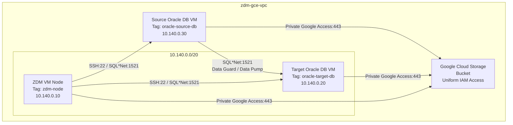
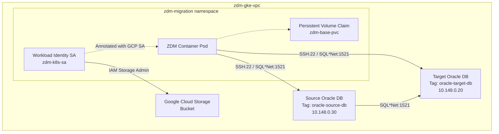
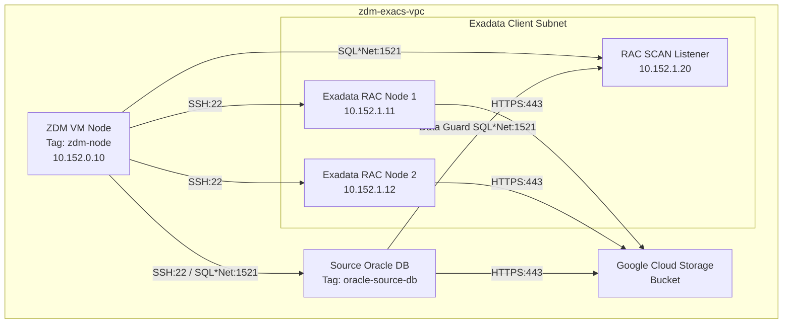
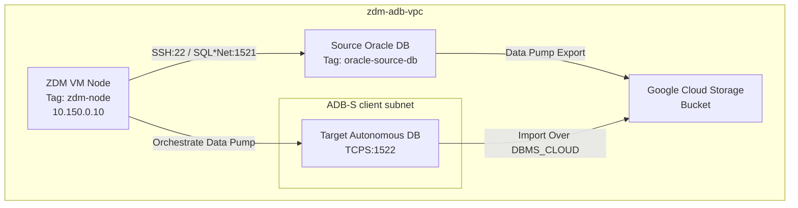

# Oracle ZDM Migration to GCP: Architecture Blueprints

This document presents the network design and component architecture blueprints for deploying Oracle Zero Downtime Migration (ZDM) on Google Cloud Platform, aligned with Oracle Maximum Availability Architecture (MAA) guidelines.

---

## 1. Blueprint: Co-managed Oracle DB on GCE VM (Compute Engine)

This blueprint illustrates ZDM running on a dedicated GCE VM orchestrating migration from a Source DB to a Target DB running on a GCE instance in the same VPC.

### Architecture Diagram

### Components and Ports
* **VPC Network:** A custom-mode VPC network (`zdm-gce-vpc`) with Private Google Access enabled.
* **Firewall Rules:**
  * **ZDM to Source/Target:** Inbound port 22 and 1521 allowed from ZDM subnet IP range to target VM instances.
  * **Data Guard replication:** Inbound port 1521 allowed between Source and Target DB instances.
  * **HTTPS (443):** Outbound traffic allowed from all nodes to Google APIs for GCS uploads.

### GCE Target DB Machine Shapes & Storage Performance

For mission-critical Oracle databases on GCE, select machine shapes and hyperdisk configurations tailored to IOPS and throughput needs:

| Machine Family | Storage Type | Max Provisioned IOPS | Max Throughput (MB/s) | Primary Use Case |
|:---|:---|:---:|:---:|:---|
| **C4** | Hyperdisk Extreme | 500,000 | 10,000 | Low-latency, ultra-high IOPS transaction processing |
| **M4N** | Hyperdisk Extreme | 500,000 | 12,500 | Enterprise Oracle databases requiring peak IOPS and maximum bandwidth |
| **M4N** | Hyperdisk Balanced | 160,000 | 2,400 | High-capacity memory-intensive databases with balanced IOPS requirements |

---

## 2. Blueprint: Containerized ZDM on GKE

This blueprint shows ZDM packaged as a Docker container running inside a private Google Kubernetes Engine (GKE) cluster.

### Architecture Diagram

### GKE Security & Workload Identity
* **Workload Identity:** Integrates the Kubernetes Service Account (`zdm-k8s-sa`) with a GCP IAM Service Account (`zdm-gke-sa`). This enables the ZDM Pod to authenticate to Google Cloud APIs (like GCS) dynamically without static JSON credentials keys.
* **Persistent Storage (PVC):** A 100 GB Persistent Volume is mounted on `/u01/zdm/zdmbase` to persist checkpoints, job configurations, and the Oracle Secure Wallet.
* **SSH Secret Mount:** A Kubernetes Secret (`zdm-ssh-keys`) is mounted on `/home/zdmuser/.ssh` with file permissions set to `0400` to allow the ZDM daemon to establish secure SSH tunnels to source and target hosts.

---

## 3. Blueprint: Oracle Database@Google Cloud - Exadata Database Service

For migrations to Exadata Database Service on OCI inside Google Cloud, ZDM coordinates RAC VMs using high-performance, low-latency private interconnect subnets.

### Architecture Diagram

### RAC and Multi-Node Features
* **SCAN Connection:** ZDM connects to the target SCAN (Single Client Access Name) listener on port 1521 rather than individual node VIPs, providing load balancing and high availability.
* **Multi-Node SSH Keys:** The ZDM VM requires private keys to establish connection to **every** Exadata VM cluster node in the RAC cluster (`grid` and `oracle` OS users).
* **Private Interconnect Connection:** Low-latency interconnect links the target Exadata client subnet directly to the GCP VPC via delegated subnets, ensuring high-speed redo transfer for Data Guard.

---

## 4. Blueprint: Oracle Database@Google Cloud - Autonomous Database (Serverless)

Autonomous Database Serverless (ADB-S) is fully managed. The target architecture does not expose operating system shells (no SSH access), meaning migrations must run in **Logical** mode.

### Architecture Diagram

### Connection and Data Pump Features
* **TCPS Port 1522:** Connections to Autonomous Database are strictly encrypted over port 1522. ZDM uses a Client Credentials Wallet (`cwallet.sso`) placed on the ZDM VM to negotiate mutual TLS (mTLS).
* **DBMS_CLOUD Integration:** ZDM configures credentials inside the Autonomous target database allowing it to fetch dump files directly from GCS bucket over HTTPS (443) during import. No backup files are written directly to target storage.
