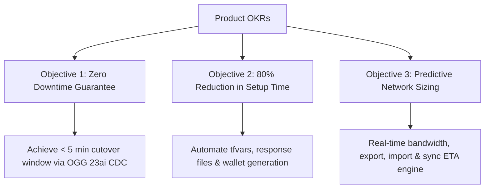
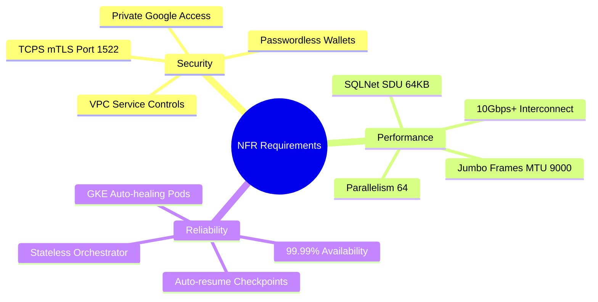
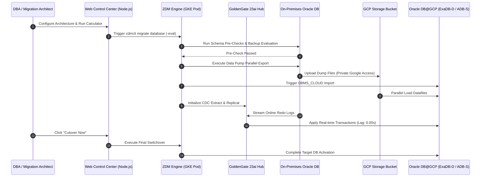
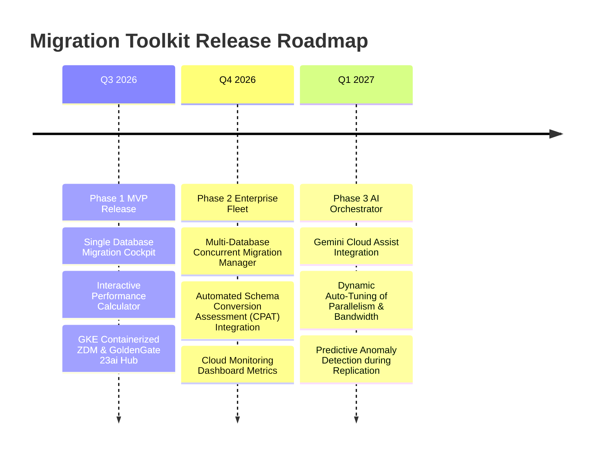

# Product Requirement Document (PRD)
## Oracle Database ZDM Migration Toolkit & Web Control Center for Google Cloud

**Document Status**: APPROVED FOR IMPLEMENTATION  
**Product Manager**: Lead Oracle Cloud Migration Architect & Product Manager, Google Cloud  
**Target Release**: Q3 2026  
**Target Audience**: Enterprise Cloud Architects, Oracle DBAs, GCP Infrastructure Engineers, System Integrators  

---

## 1. Executive Summary & Product Vision

The **Oracle Zero Downtime Migration (ZDM) & GoldenGate 23ai Control Center Toolkit** is an enterprise-grade web application and backend orchestration framework designed to automate, estimate, monitor, and execute mission-critical Oracle Database migrations to **Oracle Database@Google Cloud** (Autonomous Database Serverless `ADB-S`, Exadata Database Service `ExaDB-D`, Base Database Service `DBCS`, or co-managed Oracle DB on `GCE`).

### Vision Statement
> *"Provide a single-pane-of-glass migration cockpit that turns complex, multi-week enterprise Oracle database cloud migrations into predictable, error-free, zero-downtime automated workflows with sub-5-minute cutover maintenance windows."*

---

## 2. Problem Statement & Business Opportunity

### Key Pain Points in Legacy Oracle Database Cloud Migrations
1. **High Risk & Cost of Extended Downtime**: Traditional offline migration methods (standard Data Pump or RMAN restore) require hours or days of business downtime for multi-terabyte databases.
2. **Complex Toolchain Image Download & Configuration Friction**: Enterprise customers struggle with downloading, licensing, containerizing, and configuring the complex Oracle ZDM and GoldenGate 23ai migration toolchain. Preparing base software images, configuring Artifact Registry mirroring, and setting up Microservices deployment parameters takes weeks of manual work, directly delaying Proof of Concept (PoC) execution, stalling GCP migration decisions, and introducing significant technical risk and complexity.
3. **Manual & Error-Prone ZDM Configuration**: Managing Oracle ZDM response files (`zdm_logical.rsp`, `zdm_physical.rsp`), passwordless wallets (`orapki`/`mkstore`), and SSH key pairs across on-premises and GCP environments is complex and error-prone.
4. **Lack of Predictive Performance Visibility**: Migration teams struggle to predict transfer durations, required network interconnect bandwidth, Data Pump parallelism scaling, and GoldenGate CDC catch-up lag before launching cutovers.
5. **Fragmented Monitoring & Disconnected Tooling**: DBAs juggle SSH terminals, `zdmcli` query commands, GoldenGate Service Manager REST APIs, GCP Cloud Storage buckets, and database listener logs across disparate systems.

### The Strategic Business Opportunity
Providing a turnkey, fully deployable, automated setup for Oracle ZDM and GoldenGate 23ai on Google Cloud (via GKE/GCE Terraform blueprints, Artifact Registry image pipelines, and an intuitive Web Control Center UI):
- **Accelerates & Derisks Migration Decisions**: Eliminates weeks of upfront toolchain friction, enabling enterprise customers to immediately spin up production-ready migration infrastructure for PoCs in hours rather than months.
- **Demonstrates GCP Data Platform Execution Leadership**: Confirms to enterprise DBAs, IT directors, and cloud architects that Google Cloud possesses the tooling, automation, and operational capabilities required to execute complex, zero-downtime database platform transformations with complete confidence.

---

## 3. Associated Architectural Resources & Documentation Links

This Product Requirement Document directly references and integrates the official GCP Oracle Database Migration technical blueprints and guides:

- 📋 **Migration Assessment & Execution Checklist**: [Migration_CheckList.md](./Migration_CheckList.md) — Step-by-step 4-phase checklist covering DMA assessment, endianness verification, Cloud Interconnect sizing, and cutover procedures.
- 🏛️ **Architecture Blueprints & Network Design**: [architecture_blueprints.md](./architecture_blueprints.md) — Network diagrams for GCE VM, containerized GKE ZDM nodes, C4/M4N Hyperdisk shapes, and Oracle Database@Google Cloud integration.
- ⚡ **GCP Best Practices, Security & Configurations**: [best_practices_faq.md](./best_practices_faq.md) — Private Google Access, IAP SSH tunneling, automated `orapki`/`mkstore` wallet setup, and SQL*Net SDU tuning.
- 🐳 **GoldenGate 23ai Container Registry Setup**: [goldengate_image_gcp_registry.md](./goldengate_image_gcp_registry.md) — Guide for mirror-tagging and pushing Oracle GoldenGate 23ai microservices images to GCP Artifact Registry.
- 📊 **ZDM Migration Methods Comparison**: [zdm_comparison_setup.md](./zdm_comparison_setup.md) — Detailed comparison matrix between Logical Online, Logical Offline, and Physical Online Data Guard modes.
- 🔗 **GCP & Oracle Official Migration References**: [migration_links.md](./migration_links.md) — Consolidated links to Oracle MAA documentation and Google Cloud architecture center.

---

## 4. User Personas & Target Use Cases

| Persona | Role & Responsibilities | Key Needs & Pain Points |
| :--- | :--- | :--- |
| **Enterprise Cloud Architect** | Designs GCP landing zones, hybrid network interconnects, and database platform selection. | Needs predictive calculators for bandwidth sizing, transfer times, parallelism, and total ETA reports. Refer to [architecture_blueprints.md](./architecture_blueprints.md). |
| **Lead Oracle DBA / Migration Engineer** | Executes schema pre-checks, Data Pump exports, DBMS_CLOUD imports, and cutover switchovers. | Needs intuitive UI, automated wallet setup, real-time pipeline progress node tracking, and live CLI logs. Refer to [best_practices_faq.md](./best_practices_faq.md). |
| **GCP Cloud Infrastructure Engineer** | Provisions Terraform VPCs, subnets, GKE clusters, firewall rules, and IAM service accounts. | Needs automated `.tfvars` generation and GCP Infrastructure Manager / Cloud Build triggers. |
| **Enterprise IT Director / Program Manager** | Oversees migration governance, compliance, cutover approvals, and downtime risk management. | Needs clear executive dashboards, sub-5-minute downtime guarantees, and SLA compliance artifacts. Refer to [Migration_CheckList.md](./Migration_CheckList.md). |

---

## 5. Product Objectives & Key Results (OKRs)

- **KR 1**: Reduce pre-migration configuration setup time from 3 days to **< 15 minutes** via automated Deployment Wizard.
- **KR 2**: Achieve **< 5 minutes total cutover downtime** for 99% of online database migrations using GoldenGate 23ai CDC catch-up.
- **KR 3**: Deliver **95%+ accuracy** in estimated transfer durations and completion ETAs via the real-time Migration Calculator.
- **KR 4**: Eliminate **100% of plain-text password exposures** by enforcing passwordless `orapki`/`mkstore` wallet auto-generation (see [best_practices_faq.md#2-oracle-zdm-settings--configurations](./best_practices_faq.md#2-oracle-zdm-settings--configurations)).

---

## 6. Functional Requirements & Core Features

### Feature 1: Architecture Setup & Deployment Wizard
- **Target Platform Selection**: Support for Oracle Autonomous Database Serverless (`ADB-S`), Exadata Database Service (`ExaDB-D`), Base Database Service (`DBCS RAC`), and GCE Compute VMs (see platform comparison in [zdm_comparison_setup.md](./zdm_comparison_setup.md)).
- **Migration Strategy Selection**:
  - *Logical Online*: Data Pump Export/Import + GoldenGate 23ai CDC (Zero Downtime).
  - *Logical Offline*: Data Pump Export to GCS + DBMS_CLOUD Import.
  - *Physical Online*: Data Guard Physical Standby Replication.
- **ZDM Infrastructure Execution**: Containerized inside GKE cluster or dedicated GCE compute node.
- **Automated Configuration Generator**: Live preview and sync for `terraform.tfvars` and `zdmcli migrate database` commands.

### Feature 2: Migration Performance Calculator & Estimator
- **Interactive Sizing Controls**: Total Database Size (GB/TB), Data Pump Compression Ratio (`COMPRESSION=ALL` 4:1 default), Daily Change Volume (GB/day or MB/s).
- **Network Bandwidth Engine**: Preset selection for Dedicated Interconnect (100G/10G), Partner Interconnect (5G/1G), Cloud VPN, and custom bandwidth specification.
- **Parallelism Tuning**: Granular controls for Data Pump Export Parallelism, GCS Upload Threads, Target Import Parallelism, and GoldenGate 23ai Replicat Threads.
- **KPI Metrics Display**:
  - Effective Network Throughput (Gbps, MB/s, GB/hr).
  - Export, GCS Upload, Import, and OGG Sync Catch-up duration breakdown.
  - Total Migration Window & Cutover Maintenance ETA.
- **Visual Timeline Stacked Chart**: Interactive graphical breakdown of relative phase durations.
- **Cloud Architecture Bottleneck Analyzer**: Automated recommendations for network upgrades, parallelism scaling, and platform optimization.

### Feature 3: Live Migration Pipeline & Execution Console
- **Interactive Stage Progress Tracker**:
  1. Source DB Connection
  2. Pre-Check Evaluation (`-eval`)
  3. Data Pump Parallel Export
  4. Direct GCS Bucket Upload
  5. DBMS_CLOUD Target Import
  6. GoldenGate 23ai CDC Replication Sync
  7. Final Cutover Switchover
- **Interactive Control Buttons**: Trigger `-eval` re-check, Pause replication, Trigger Cutover, or Abort job via REST API gateway.
- **Live Metrics Ticker**: Real-time GoldenGate replication lag (sec) and transaction throughput (ops/sec).

### Feature 4: Infrastructure & Endpoint Health Probe Monitor
- **Real-Time Probing Table**:
  - ZDM Orchestrator Engine (`zdm-service:8900`)
  - GoldenGate 23ai Service Manager (`goldengate-service:9011`)
  - GoldenGate Admin Server (`goldengate-service:9012`)
  - Target Database SCAN Listener (`10.150.20.10:1521`)
  - Autonomous Database Endpoint (`10.150.20.10:1522` TCPS mTLS)
- **Passwordless Auto-Login Wallet Manager**: One-click auto-generation of `src_admin`, `src_ggadmin`, `tgt_admin`, `tgt_ggadmin`, and `ogg_oggadmin` PKCS12 wallets using `orapki`/`mkstore`.

### Feature 5: Live Log Inspector & CLI Execution Terminal
- Streaming console displaying live logs from `/u01/zdm/zdmbase/crsdata/*/rhp/logs/` and GoldenGate Service Manager.

---

## 7. Non-Functional Requirements (NFRs)

1. **Security & Data Isolation**:
   - Zero hardcoded passwords; compulsory use of passwordless auto-login wallets.
   - Private Google Access enabled for GCS transfers (`storage.googleapis.com`) without traversing public internet.
   - mTLS encrypted database traffic over port 1522 for Autonomous Databases.
2. **Scalability & Performance**:
   - Support for VLDB database migrations up to **50 TB**.
   - Maximum Data Pump parallelism of **Degree 64** on Exadata platforms.
   - MTU 9000 (Jumbo Frames) support across GCP Interconnect links.
3. **Availability & Resilience**:
   - GKE pod deployment with auto-healing, restart policies, and persistent storage volume claims (`PVC`) for ZDM status state files.

---

## 8. High-Level Technical Architecture

---

## 9. Release Roadmap & Future Phases

---

## 10. References & Technical Resource Index

| Resource Title | File Location | Key Content Covered |
| :--- | :--- | :--- |
| **Oracle DB Migration Checklist** | [Migration_CheckList.md](./Migration_CheckList.md) | Phase 1-4 assessment, endianness, dry-run, integrity checks |
| **Architecture Blueprints** | [architecture_blueprints.md](./architecture_blueprints.md) | GCE VM, GKE Container, C4/M4N Hyperdisk sizing specs |
| **Best Practices & FAQ** | [best_practices_faq.md](./best_practices_faq.md) | Wallet security, SQL*Net SDU, Private Google Access |
| **GoldenGate 23ai GCP Image Registry** | [goldengate_image_gcp_registry.md](./goldengate_image_gcp_registry.md) | Artifact Registry setup for OGG 23ai microservices container |
| **ZDM Migration Methods Setup** | [zdm_comparison_setup.md](./zdm_comparison_setup.md) | Detailed comparison between Logical/Physical Online & Offline |
| **External Migration Links** | [migration_links.md](./migration_links.md) | Oracle MAA and GCP Cloud Architecture Center docs |
